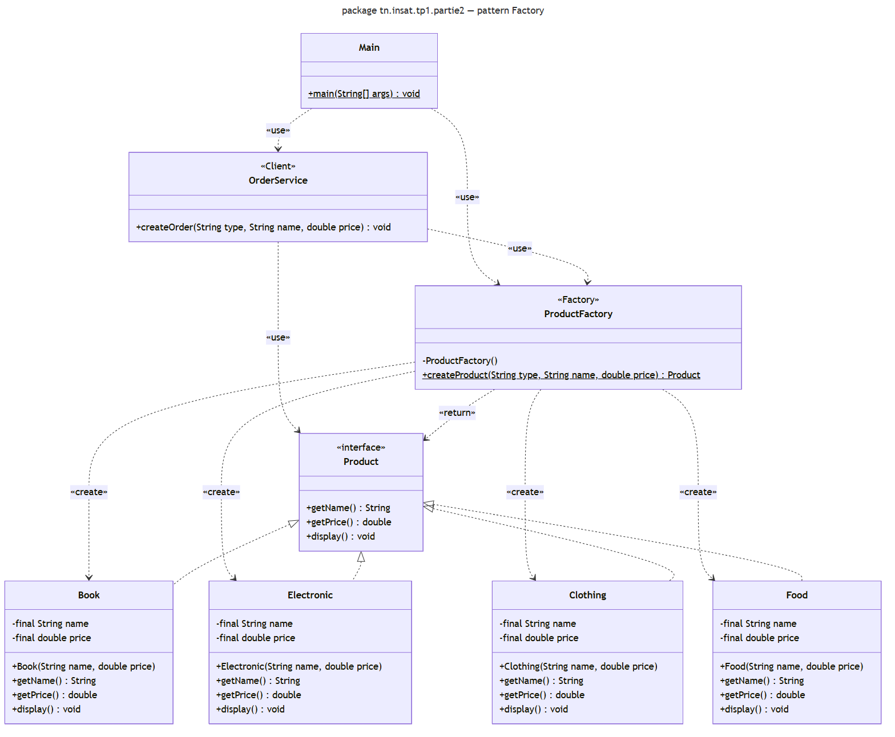
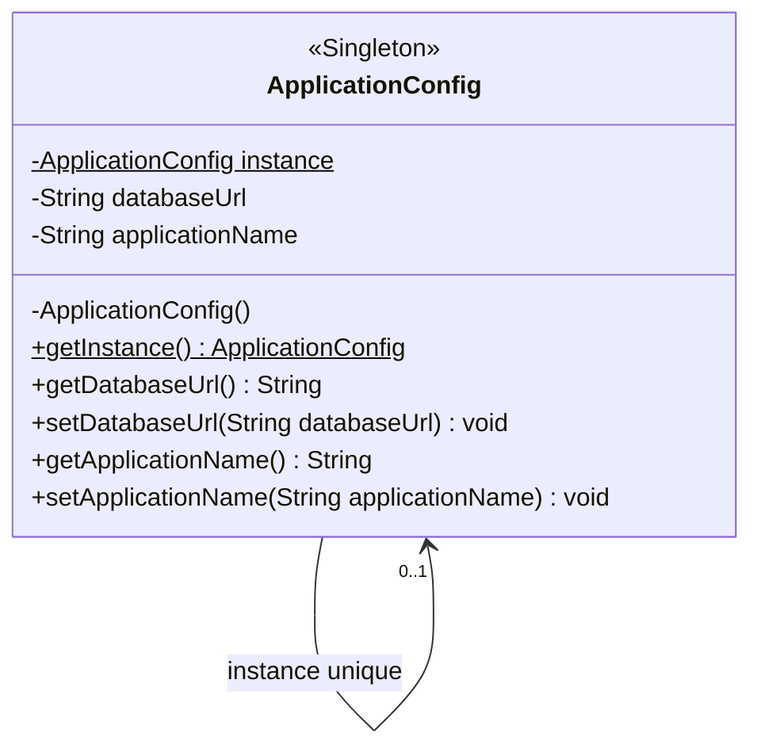
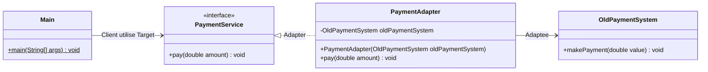
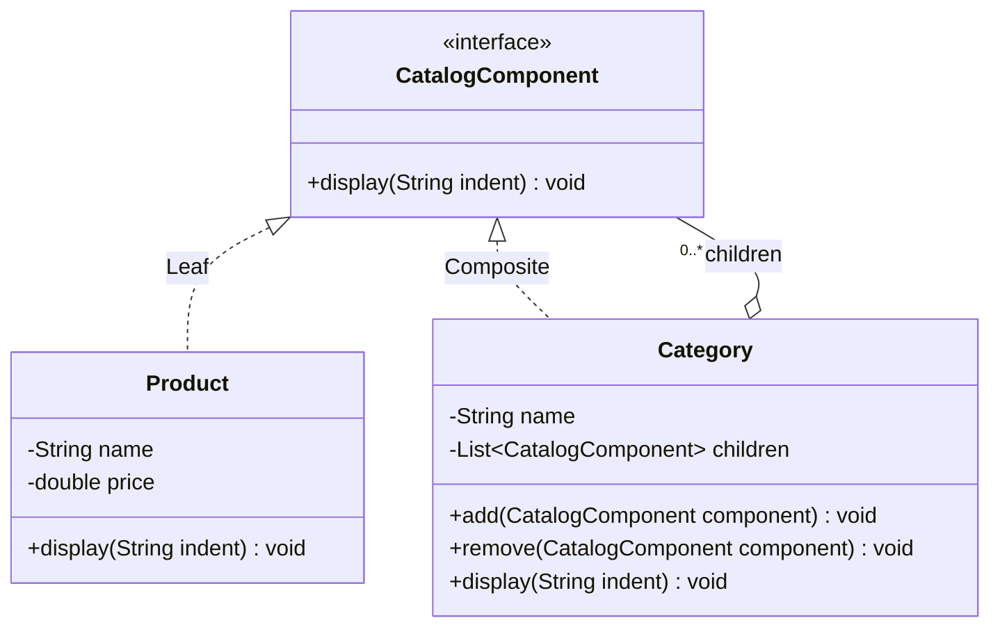
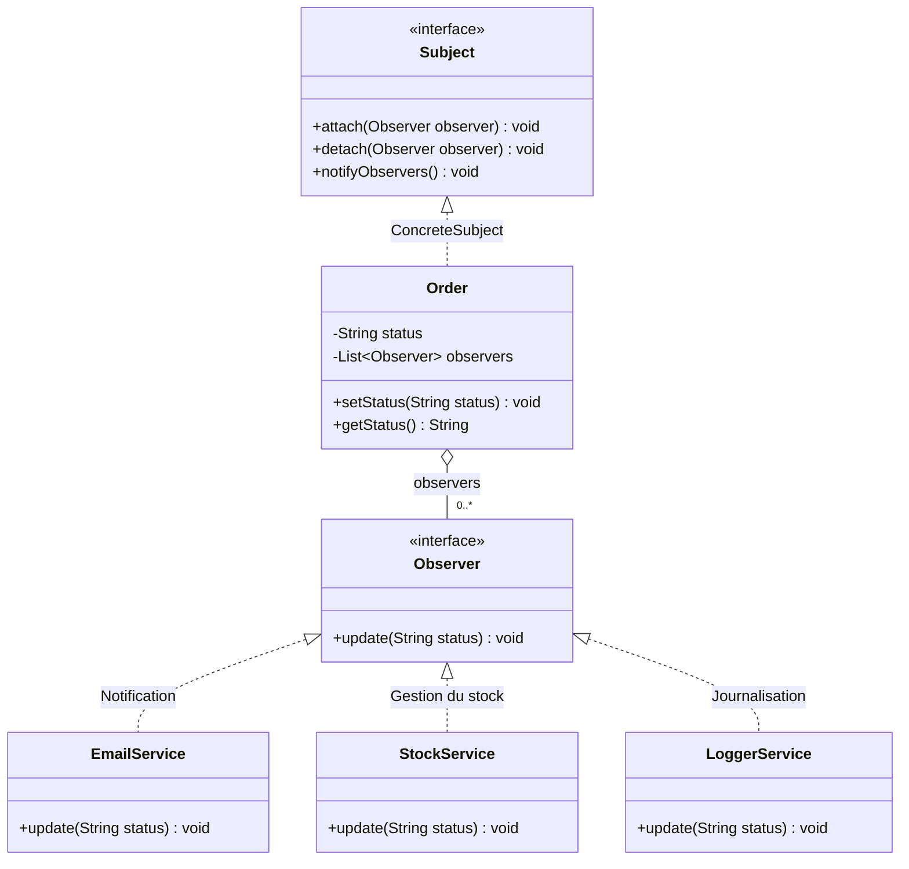
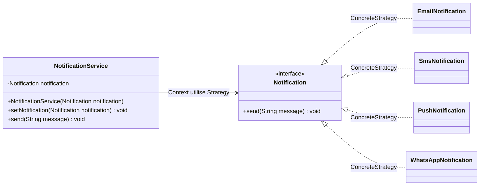
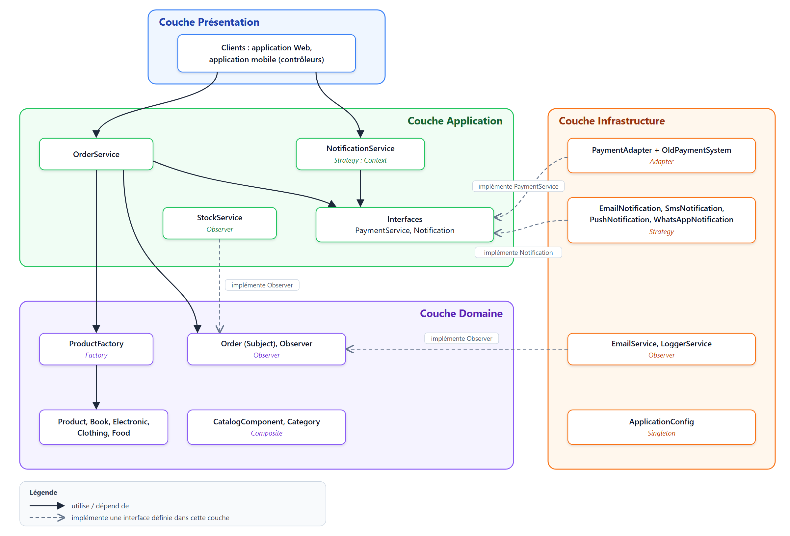
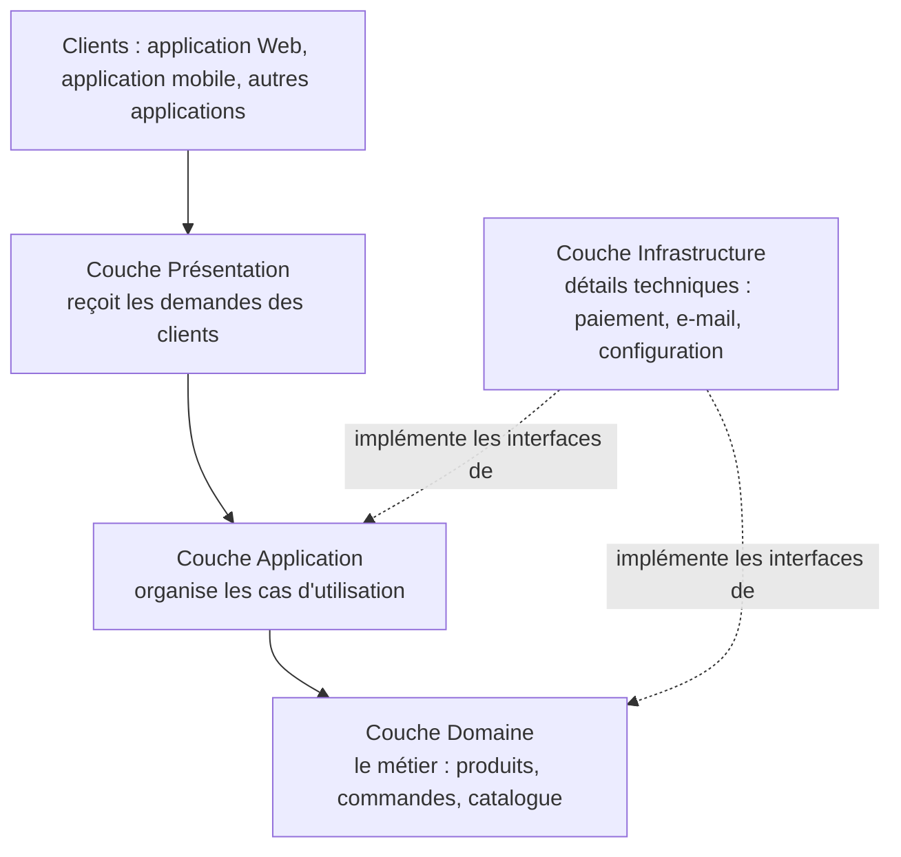

# TP1 — Design Patterns : refactoring d'une application Java

**Mohamed Helmi Lakhder & Oussama Bouchalah**

---

## Partie 1 — Analyse du code existant

### 1. Problèmes de conception

- **Création directe avec `new`** : `OrderService` crée lui-même les produits, il est donc lié à la classe concrète.
- **Cascade de `if / else` sur un texte** : chaque nouveau type ajoute une branche.
- **Le type n'est qu'un `String`** : un livre et un vêtement sont des objets de la même classe, sans comportement propre.
- **Trop de responsabilités** : `OrderService` choisit le type, crée le produit et gère la commande.

### 2. Pourquoi ajouter un type rend le code difficile à maintenir

Pour ajouter `FOOD`, il faut **modifier `OrderService`** (une branche de plus), puis tout retester. Si d'autres classes créent aussi des produits, il faut recopier le même `if/else` partout, avec un risque d'oubli.

### 3. Principe mis à mal

Le **principe ouvert/fermé (OCP, Open-Closed Principle)** : une classe doit être ouverte à l'extension mais fermée à la modification. Ici, ajouter un type oblige à modifier `OrderService`. Le SRP (une seule responsabilité) et le DIP (dépendre d'abstractions) sont aussi touchés.

### 4. Pattern proposé

**Factory** (Simple Factory) : une classe `ProductFactory` crée le bon produit selon son type, et chaque produit devient une classe qui implémente une interface `Product`.

### 5. Justification

- Le problème porte sur la **création des objets** : on choisit donc un pattern de création.
- Tous les `new` sont regroupés dans la fabrique. `OrderService` ne connaît plus que l'interface `Product`.
- Ajouter un type = une nouvelle classe + un `case` dans la fabrique, **sans toucher à `OrderService`**.
- La Simple Factory est la version la plus simple qui résout le problème. Factory Method ou Abstract Factory seraient trop lourds ici.

---

## Partie 2 — Refactoring de la création des produits (Factory)

Code : dossier [`partie2/`](src/main/java/tn/insat/tp1/partie2).



### 1. Interface `Product` avec `display()`

```java
public interface Product {
    String getName();
    double getPrice();
    void display();
}
```

### 2. Classes `Book`, `Electronic` et `Clothing`

```java
public class Book implements Product {

    private final String name;
    private final double price;

    public Book(String name, double price) {
        this.name = name;
        this.price = price;
    }

    @Override
    public String getName() { return name; }

    @Override
    public double getPrice() { return price; }

    @Override
    public void display() {
        System.out.println("Book : " + name + " - " + price + " DT");
    }
}
```

`Electronic` et `Clothing` sont identiques ; seul le texte de `display()` change. Chaque classe a donc son propre affichage (polymorphisme).

### 3. Classe responsable de la création : `ProductFactory`

```java
public class ProductFactory {

    private ProductFactory() { }

    public static Product createProduct(String type, String name, double price) {
        switch (type.toUpperCase()) {
            case "BOOK":
                return new Book(name, price);
            case "ELECTRONIC":
                return new Electronic(name, price);
            case "CLOTHING":
                return new Clothing(name, price);
            case "FOOD":
                return new Food(name, price);
            default:
                throw new IllegalArgumentException("Unknown product type: " + type);
        }
    }
}
```

C'est le **seul endroit** qui décide quelle classe créer. La méthode retourne un `Product` : l'appelant ne connaît pas la classe concrète.

### 4. `OrderService` sans `new`

```java
public void createOrder(String type, String name, double price) {
    Product product = ProductFactory.createProduct(type, name, price);
    System.out.println("Order created for " + product.getName());
}
```

Le `if/else` et les `new` ont disparu : `OrderService` ne connaît que `Product` et `ProductFactory`.

### 5. Ajouter `Food` sans modifier `OrderService`

Il suffit d'écrire la classe `Food` (comme `Book`) et d'ajouter `case "FOOD"` dans la fabrique. **`OrderService` n'est pas modifié.**

### 6. Tester plusieurs créations

```java
Product p = ProductFactory.createProduct("BOOK", "Design Patterns", 45);
p.display();
ProductFactory.createProduct("ELECTRONIC", "Laptop", 2500).display();
ProductFactory.createProduct("CLOTHING", "Jacket", 180).display();
ProductFactory.createProduct("FOOD", "Dates", 12.5).display();

OrderService orderService = new OrderService();
orderService.createOrder("BOOK", "Design Patterns", 45);
orderService.createOrder("FOOD", "Dates", 12.5);
```

Résultat de `partie2.Main` :

```text
Book : Design Patterns - 45.0 DT
Electronic : Laptop - 2500.0 DT
Clothing : Jacket - 180.0 DT
Food : Dates - 12.5 DT
Order created for Design Patterns
Order created for Dates
```

### 7. Pourquoi c'est plus flexible que la création directe

- `OrderService` dépend d'une **interface**, pas des classes concrètes : on peut ajouter ou modifier un produit sans le toucher (OCP, DIP).
- La création est à **un seul endroit** : pour un nouveau type, on sait où intervenir.
- Chaque produit est une **vraie classe** avec son propre comportement, au lieu d'un simple texte.

---

## Partie 3 — Instance unique pour la configuration (Singleton)

Code : dossier [`partie3/`](src/main/java/tn/insat/tp1/partie3).

**Problème :** avec un constructeur `public`, chaque composant peut créer sa propre configuration, et elles peuvent être différentes. **Le Singleton** garantit qu'il n'existe **qu'une seule instance**, accessible partout.



### 1. Modifier le constructeur et l'accès à l'instance

```java
private static ApplicationConfig instance;   // l'unique instance

private ApplicationConfig() {                // avant : public
}
```

Le constructeur devient **`private`** : `new ApplicationConfig()` ne compile plus en dehors de la classe.

### 2. Implémenter `getInstance()`

```java
public static synchronized ApplicationConfig getInstance() {
    if (instance == null) {
        instance = new ApplicationConfig();
    }
    return instance;
}
```

- Au premier appel, l'objet est créé ; ensuite, on retourne **toujours le même**.
- `synchronized` empêche deux threads de créer deux instances en même temps.

### 3. Vérifier que `c1` et `c2` sont le même objet

```java
ApplicationConfig c1 = ApplicationConfig.getInstance();
ApplicationConfig c2 = ApplicationConfig.getInstance();
System.out.println(c1 == c2);

c1.setApplicationName("INSAT Shop");
System.out.println(c2.getApplicationName());
```

Résultat de `partie3.Main` :

```text
true
INSAT Shop
```

`true` : `c1` et `c2` désignent le même objet. Le nom modifié via `c1` se lit via `c2`.

### 4. Contexte où ce pattern est pertinent

Quand un objet doit être **unique et partagé** par toute l'application : configuration, journal (logger), pool de connexions à la base, cache.

Précaution : c'est une sorte de variable globale, à utiliser seulement si l'unicité est vraiment nécessaire. En microservices, il est unique **par programme** (par JVM), pas pour tout le système.

---

## Partie 4 — Intégration d'un ancien système de paiement (Adapter)

Code : dossier [`partie4/`](src/main/java/tn/insat/tp1/partie4).

**Problème :** le client attend `PaymentService.pay()`, mais l'ancien système propose `makePayment()`, et il n'implémente pas `PaymentService`. **L'Adapter** rend compatibles ces deux interfaces sans modifier ni le client ni l'ancien système.



### 1. Classe intermédiaire : `PaymentAdapter`

```java
public class PaymentAdapter implements PaymentService {

    private final OldPaymentSystem oldPaymentSystem;

    public PaymentAdapter(OldPaymentSystem oldPaymentSystem) {
        this.oldPaymentSystem = oldPaymentSystem;
    }

    @Override
    public void pay(double amount) {
        oldPaymentSystem.makePayment(amount);
    }
}
```

L'adaptateur a la forme attendue par le client (`implements PaymentService`) et **traduit** `pay()` en `makePayment()`.

### 2. Code client indépendant de l'ancien système

```java
PaymentService payment = new PaymentAdapter(new OldPaymentSystem());
payment.pay(250);
```

Le client ne manipule que `PaymentService` et n'appelle jamais `makePayment()`. `OldPaymentSystem` n'apparaît qu'à la ligne de création.

### 3. Tester un paiement de 250

Résultat de `partie4.Main` :

```text
Payment : 250.0
```

L'appel `pay(250)` est bien arrivé dans `makePayment()` de l'ancien système.

### 4. Pourquoi ne pas modifier `OldPaymentSystem`

- On n'a souvent **pas le droit ou pas le code source** (bibliothèque externe, fournisseur).
- **Il fonctionne** et d'autres programmes l'utilisent peut-être : le modifier risque de les casser.
- **OCP** : on ajoute une classe au lieu de modifier un code qui marche.
- Si on abandonne l'ancien système plus tard, seul l'adaptateur change ; le client ne bouge pas.

---

## Partie 5 — Catalogue sous forme d'arbre (Composite)

Code : dossier [`partie5/`](src/main/java/tn/insat/tp1/partie5).

**Problème :** un catalogue contient des catégories, qui contiennent des produits ou d'autres catégories. **Le Composite** permet de traiter un produit et une catégorie **de la même manière**.



Les deux classes **sont** des `CatalogComponent`. `Product` est une **feuille** : il ne contient rien. `Category` est un **composite** : elle **contient** une liste de `CatalogComponent`.

### 1. Abstraction commune

```java
public interface CatalogComponent {
    void display(String indent);
}
```

### 2. `Product` : élément individuel

```java
public class Product implements CatalogComponent {

    private final String name;
    private final double price;

    public Product(String name, double price) {
        this.name = name;
        this.price = price;
    }

    @Override
    public void display(String indent) {
        System.out.println(indent + "- " + name + " (" + price + " DT)");
    }
}
```

### 3 et 4. `Category` : contient des produits et/ou des catégories

```java
public class Category implements CatalogComponent {

    private final String name;
    private final List<CatalogComponent> children = new ArrayList<>();

    public Category(String name) {
        this.name = name;
    }

    public void add(CatalogComponent component) {
        children.add(component);
    }

    public void remove(CatalogComponent component) {
        children.remove(component);
    }
    ...
}
```

La liste est de type `List<CatalogComponent>` : `add()` accepte donc un produit **ou** une autre catégorie.

### 5. `display()` affiche toute l'arborescence

```java
@Override
public void display(String indent) {
    System.out.println(indent + "+ " + name);
    for (CatalogComponent child : children) {
        child.display(indent + "    ");
    }
}
```

Une catégorie affiche son nom, puis demande à chaque enfant de s'afficher avec 4 espaces de plus. Un enfant catégorie fait de même (récursion). Un produit affiche juste sa ligne, et la récursion s'arrête là.

### 6. Test à partir de l'objet Catalogue

Le `Main` construit `Catalogue` → `Books`, `Electronics`, `Clothing` → produits, puis appelle `catalogue.display("")`. Résultat de `partie5.Main` :

```text
+ Catalogue
    + Books
        - Book 1 (45.0 DT)
        - Book 2 (38.5 DT)
    + Electronics
        - Laptop (2500.0 DT)
        - Smartphone (1200.0 DT)
    + Clothing
        - Shirt (60.0 DT)
        - Jacket (180.0 DT)
```

---

## Partie 6 — Notification des changements d'état (Observer)

Code : dossier [`partie6/`](src/main/java/tn/insat/tp1/partie6).

**Problème :** quand une commande change d'état, l'e-mail, le stock et le journal doivent être prévenus. **L'Observer** permet à `Order` de les prévenir automatiquement **sans les connaître**.



### 6 et 7. Abstractions `Observer` et `Subject`

```java
public interface Observer {
    void update(String status);
}

public interface Subject {
    void attach(Observer observer);
    void detach(Observer observer);
    void notifyObservers();
}
```

### 8 et 10. `Order`, le sujet observé, notifie à chaque changement

```java
public class Order implements Subject {

    private String status = "CREATED";
    private final List<Observer> observers = new ArrayList<>();

    @Override
    public void attach(Observer observer) { observers.add(observer); }

    @Override
    public void detach(Observer observer) { observers.remove(observer); }

    @Override
    public void notifyObservers() {
        for (Observer observer : observers) {
            observer.update(status);
        }
    }

    public void setStatus(String status) {
        this.status = status;
        notifyObservers();          // notification automatique
    }

    public String getStatus() { return status; }
}
```

`Order` ne connaît que l'interface `Observer` : on n'y trouve ni `EmailService`, ni `StockService`, ni `LoggerService`.

### 9. Les observateurs

```java
public class EmailService implements Observer {

    @Override
    public void update(String status) {
        System.out.println("EmailService : email sent to customer, order status = " + status);
    }
}
```

`StockService` et `LoggerService` sont écrits de la même façon (l'envoi réel est simulé par un affichage).

### 11. Test CREATED → SHIPPED

```java
Order order = new Order();
order.attach(new EmailService());
order.attach(new StockService());
order.attach(new LoggerService());
System.out.println("Initial status Before Update : " + order.getStatus());
order.setStatus("SHIPPED");
```

Résultat de `partie6.Main` :

```text
Initial status Before Update : CREATED
EmailService : email sent to customer, order status = SHIPPED
StockService : stock updated, order status = SHIPPED
LoggerService : [LOG] order status changed to SHIPPED
```

### Question : et si `Order` appelait directement `emailService.update()`, etc. ?

```java
public class Order {
    private String status = "CREATED";
    private EmailService emailService = new EmailService();
    private StockService stockService = new StockService();
    private LoggerService loggerService = new LoggerService();

    public void setStatus(String status) {
        this.status = status;
        emailService.update(status);
        stockService.update(status);
        loggerService.update(status);
    }
}
```

- **Couplage fort** : `Order` dépend de chaque service. Si `EmailService` renomme `update()`, il faut modifier `Order`.
- **OCP violé** : ajouter un service (SMS) ou en retirer un oblige à modifier `Order`.
- **Pas de souplesse** : impossible d'abonner ou de désabonner un service pendant l'exécution.
- **Tests difficiles** : tester un changement d'état enverrait de vrais e-mails.

---

## Partie 7 — Challenge : choisir le pattern adapté (Strategy)

Code : dossier [`partie7/`](src/main/java/tn/insat/tp1/partie7).

Code initial :

```java
public void send(String type, String message) {
    if (type.equals("EMAIL")) {
        System.out.println("Sending Email : " + message);
    }
    else if (type.equals("SMS")) {
        System.out.println("Sending SMS : " + message);
    }
    else if (type.equals("PUSH")) {
        System.out.println("Sending Push Notification : " + message);
    }
}
```

### 1. Problème de conception

- Une **cascade de `if/else`** sur un texte choisit la façon d'envoyer : ajouter WhatsApp oblige à **modifier** la classe (OCP violé).
- Une seule méthode contient le code de **tous** les moyens d'envoi (SRP).
- Un type inconnu est **ignoré en silence**.

### 2. Pattern choisi : Strategy

- On a une **famille d'algorithmes** (les façons d'envoyer) interchangeables. Strategy met chacun dans sa propre classe, derrière une interface commune.
- Rôles : `Notification` = Strategy, `EmailNotification`… = ConcreteStrategy, `NotificationService` = Context.
- Pas **Factory** (on ne veut pas créer mais faire varier un comportement), ni **Observer** (on envoie par **un** moyen, pas à tous les abonnés), ni **Adapter** (pas d'interface incompatible).



### 3. Code refactorisé

```java
public interface Notification {
    void send(String message);
}

public class EmailNotification implements Notification {
    @Override
    public void send(String message) {
        System.out.println("Sending Email : " + message);
    }
}
// SmsNotification et PushNotification : même forme

public class NotificationService {

    private Notification notification;

    public NotificationService(Notification notification) {
        this.notification = notification;
    }

    public void setNotification(Notification notification) {
        this.notification = notification;
    }

    public void send(String message) {
        notification.send(message);      // plus aucun if/else
    }
}
```

### 4. Ajouter `WhatsAppNotification` sans modifier la classe principale

```java
public class WhatsAppNotification implements Notification {
    @Override
    public void send(String message) {
        System.out.println("Sending WhatsApp : " + message);
    }
}
```

**`NotificationService` n'est pas modifié.** Résultat de `partie7.Main`, qui envoie le même message par les 4 moyens :

```text
Sending Email : Your order has been shipped
Sending SMS : Your order has been shipped
Sending Push Notification : Your order has been shipped
Sending WhatsApp : Your order has been shipped
```

### 5. Ancienne et nouvelle architecture

| Critère | Avant (`if/else`) | Après (Strategy) |
|---|---|---|
| **Modularité** | Tout dans une seule méthode | Une classe par moyen d'envoi |
| **Couplage** | Le service contient le code de tous les moyens | Le service ne dépend que de l'interface `Notification` |
| **Maintenabilité** | Ajouter WhatsApp = modifier du code qui marche | Ajouter WhatsApp = écrire une nouvelle classe |

### 6. Diagramme d'architecture



Les dépendances vont **vers l'intérieur** (Présentation → Application → Domaine). L'infrastructure **implémente** des interfaces définies par les couches internes : on peut la remplacer sans toucher au métier.

### 7. Place des patterns étudiés dans cette architecture

| Pattern | Couche | Rôle |
|---|---|---|
| **Factory** | Domaine | Crée les produits pour `OrderService` |
| **Singleton** | Infrastructure | Configuration unique de l'application |
| **Adapter** | Infrastructure | Branche l'ancien paiement sur `PaymentService` |
| **Composite** | Domaine | Catalogue en arbre |
| **Observer** | Domaine (`Order`) + observateurs en Application/Infrastructure | Prévient les services quand une commande change d'état |
| **Strategy** | Application (interface) + Infrastructure (classes d'envoi) | Moyens de notification interchangeables |

### Question : pourquoi un Design Pattern n'est pas une architecture complète ?

- Un pattern résout **un problème précis**, sur quelques classes (créer des objets, adapter une interface…).
- Une architecture organise **toute l'application** : couches, responsabilités, sens des dépendances, clients.
- Une architecture **combine plusieurs patterns**, chacun là où il résout un problème. Utiliser un pattern sans problème à résoudre complique le code inutilement.

---

## Partie 8 — Question d'architecture (architecture en couches)



| Couche | Rôle | Dépend de |
|---|---|---|
| **Présentation** | Reçoit les demandes des clients (API REST, contrôleurs) | Application |
| **Application** | Organise les cas d'utilisation (commander, payer, notifier) | Domaine |
| **Domaine** | Le métier : produits, commandes, catalogue | Rien |
| **Infrastructure** | Détails techniques : paiement, e-mail, configuration | Application et Domaine (implémente leurs interfaces) |

### Dans quelle couche placer chaque élément ?

| Élément | Couche | Pourquoi |
|---|---|---|
| `Product` | Domaine | Objet métier |
| `ProductFactory` | Domaine | Crée les objets du domaine |
| `Order` | Domaine | Objet métier (commande et son état) |
| `OrderService` | Application | Organise le cas « passer une commande » |
| `PaymentAdapter` | Infrastructure | Lien avec un système externe |
| `EmailService` | Infrastructure | Envoi d'e-mails : détail technique |
| `ApplicationConfig` | Infrastructure | Paramètres techniques |

L'interface `PaymentService` est dans l'**Application** (c'est `OrderService` qui en a besoin), et `Observer` dans le **Domaine** (c'est `Order` qui prévient). L'infrastructure les implémente : elle dépend des couches internes, jamais l'inverse.

### Plusieurs types de clients

L'application Web, l'application mobile et les autres clients passent tous par la **couche Présentation** (par exemple une API REST commune). Ils réutilisent les mêmes couches Application et Domaine : les règles métier sont écrites **une seule fois**, et un nouveau client ne demande qu'un ajout dans la Présentation.
